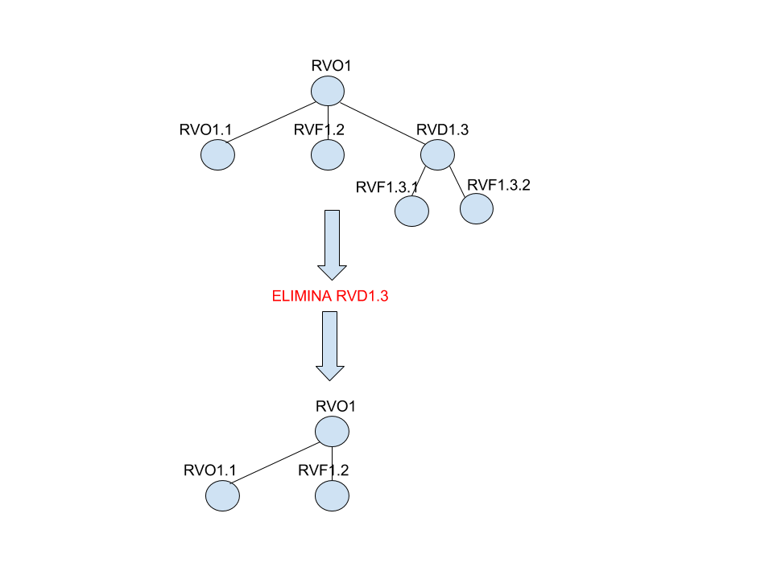
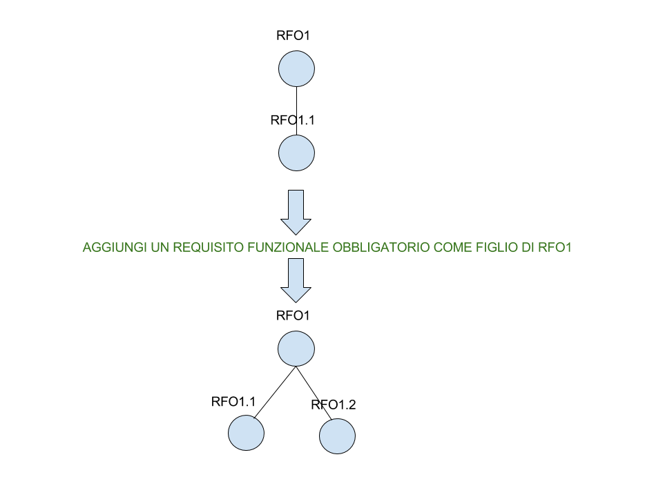

# Manuale utente
### Info generali
Nelle form di inserimento e modifica delle varie sezioni,
i campi obbligatori sono indicati da **\***.

### Fonti
E’ una sezione pensata per mantenere traccia di tutte le fonti (capitolati, verbali, ecc) che hanno determinato l’individuazione di un requisito o caso d’uso.
Una fonte è caratterizzata da Nome e Descrizione. E’possibile inserire, modificare o eliminare fonti, oltre ad esportare in LaTeX una tabella contenente tutte le informazioni sulle fonti.
Cliccando sull’IdFonte, inoltre, è possibile vedere il dettaglio della fonte selezionata.  
**IMPORTANTE:**  
*È possibile eliminare una fonte solamente dopo aver eliminato tutti i Requisiti/Casi d’Uso ad essa riferiti, pena un errore di chiave esterna in mysql!!*

### Glossario:
Raccoglie i termini di glossario attraverso la notazione utilizzata dal pacchetto glossaries di LaTeX (utilizzando la sintassi indicata nel relativo topic). E’possibile inserire, modificare o eliminare termini, oltre ad esportare in LaTeX l’intero glossario strutturato secondo la forma “newglossaryentry” del package glossaries di LaTex e a fornire l’insieme di termini al software Gloxy.

### Use Case
Vale lo stesso sistema di gestione utilizzato per i Requisiti (quindi vedi prossima sezione),
 in più si può indicare il nome del diagramma (se esiste, tipicamente generato in UML) che ci
si aspetta sia generato come .pdf; ad esempio se il nome è UC1 verrà associato
ad UC1.pdf, per settare dove il software andrà a cercare il .pdf modificare
il path indicato nel codice php.

### Requisiti:
I requisiti sono organizzati secondo una struttura gerarchica ad albero. Ogni Requisito è identificato da un IdRequisito
(che può essere modificato,e la cui modifica viene gestita in modo automatico) descritto dalla seguente sintassi:

R [Tipo] [Importanza] [posizione nella gerarchia]

* R indica che è un requisito
* Tipo: possiamo distinguere 4 tipologie di alberi:
  1. RF (funzionali)
  2. RV (vincolo)
  3. RQ (qualità)
  4. RP (prestazionali)
* Importanza: ogni requisito, inoltre, è caratterizzato dalla sua importanza:
  1. O (obbligatorio)
  2. D (desiderabile)
  3. F (facoltativo)
* Con la posizione nella gerarchia si intende che posizione ha rispetto al padre e agli eventuali fratelli (nel caso fosse un figlio) altrimenti rispetto alle radici dello stesso tipo.
**Ciò significa che l’importanza non è un informazione discriminante per l’ordinamento di un Requisito all’interno della foresta di alberi**.
* La parte numerica permette di definire le relazioni padre-figlio e nodo-fratello (che possiamo vedere come una suddivisione in componenti del requisito padre), ma **solo all'interno di alberi dello stesso tipo**.  Ciò significa che:
un requisito funzionale (se ha un padre) sarà sicuramente figlio di un altro requisito funzionale, e così via per ogni tipo;
*una relazione di padre-figlio può legare due nodi con importanza diversa (padre Obbligatorio e figlio Desiderabile)*, ogni relazione padre-figlio deve rispettare queste due condizioni:
1. padre e figlio sono dello stesso tipo;
2. l’importanza del padre è maggiore o uguale di quella del figlio, seguendo l'ordinamento  
**Obbligatorio > Desiderabile > Facoltativo**  
E’ possibile inserire, modificare ed eliminare un requisito;
è inoltre possibile vedere un dettaglio del requisito (inclusi figli del requisito, use-case correlati e fonte da cui è stato tratto) e lo storico delle modifiche applicate.  
**IMPORTANTE:**  
durante l’inserimento o la modifica di un requisito, se si vuole indicare un padre attraverso la “select” è necessario che le caratteristiche del requisito e del padre selezionato rispettino le regole sopra indicate.

#### Gestione automatica della gerarchia
**IMPORTANTE:**  
PragmaDB gestisce in modo automatico la gerarchia di Requisiti secondo
la logica seguente:
* La modifica del tipo di un requisito causa lo spostamento del requisito (e di tutto il suo sottoalbero) all’interno dell’albero del nuovo tipo;
* l’eliminazione di un requisito comporta anche la *cancellazione di tutti i suoi discendenti*;
* eventuali nodi/requisiti spostati o eliminati nella gerarchia vengono compensati spostando al posto del nodo/requisito eliminato *l’ultimo fratello del requisito al momento dell’eliminazione o dello spostamento*.

#### Esempi testuali
* RFO1 ->
requisito funzionale obbligatorio radice, ed è la prima radice tra i Requisiti del tipo funzionale
* RFF1.1 ->
requisito funzionale facoltativo figlio, potrebbe essere figlio di RFO1 perchè compatibli per tipo
* RVO1.1 ->  requisito vincolo obbligatorio figlio,non può essere figlio di RFO1 perchè incompatible per tipo.  
**IMPORTANTE**  
L’importanza è discriminante però nel rapporto un cui il figlio si trova rispetto al padre.  
Praticamente, riprendendo l’esempio precedente:
* RFF1.1 può essere figlio di RFO1 anche perchè la sua importanza è <= rispetto all’importanza del padre.
* RFO1 potrebbe essere padre di qualsiasi requisito di tipo Funzionale perchè detiene la maggior importanza possibile e quindi sarà sempre >= rispetto a qualsiasi figlio che abbia *lo stesso tipo*.
* RFO1.1.1 invece non può essere inserito come figlio di RFF1.1 perchè ha importanza minore(anche se ha lo stesso tipo e numero gerarchico ragionevole per essere figlio) rispetto al padre.
Infine si fa notare il caso in cui vengono inserite più radici con lo stesso tipo e importanza diversa, si ottiene:
RFO1, RFD2 , RFO3

#### Esempi grafici
##### Eliminazione

##### Inserimento  

##### Eliminazione e modifica con spostamento  

### Consistenza
PragmaDB ha un sistema interno (abbastanza naive perchè basato su TIMESTAMP) che garantisce mutua esclusione nella *modifica ai dati*. Ciò significa che permette l’accesso di più utenti a procedure di modifica/eliminazione (**quindi in lettura**) di uno stesso dato, accettando come valida la prima modifica confermata (**scrittura**) e avvisando gli altri utenti che non sono riusciti a compiere con successo la modifica.
